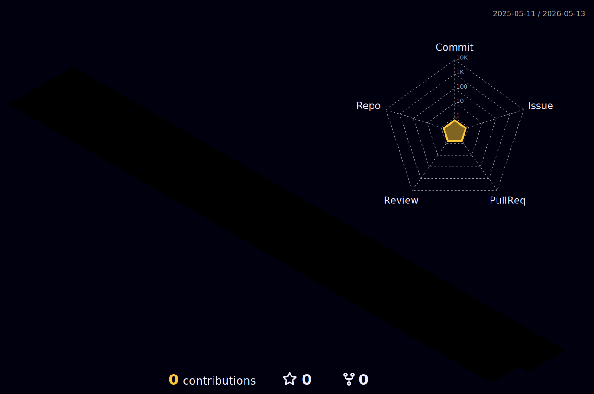

## 

<h5 align="center">A passionate Web Development & Video Editing from Indonesia</h5>
 
 

- 🔭 I’m currently working on **RealWorld😋**

- 🌱 I’m currently learning **Golang (Go) Language**

- 👨‍💻 All of my projects are available at [https://aliff.vercel.app/](https://aliff.vercel.app/)

- 💬 Ask me about **Computer ,Network & Editing**

- 📫 How to reach me **hedlif22@gmail.com**

- ⚡ Fun fact **I think I am funny**
 

## Connect with me  

  

  
  

   

## Languages and Tools

 

  
<h3 align="center">Last My Music</h3>

  

  

 

## STATS ME

 

<h2 align="center">Support Me</h2>

  
 
  

  

